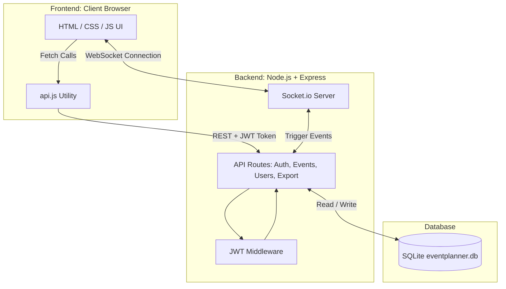
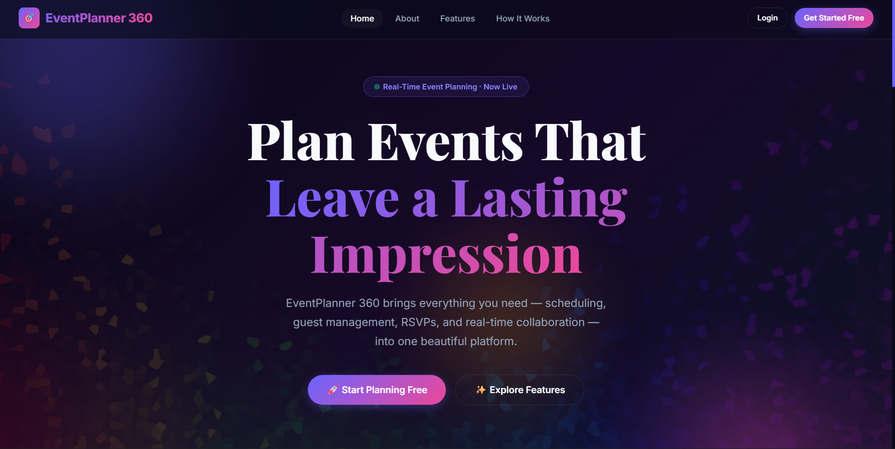
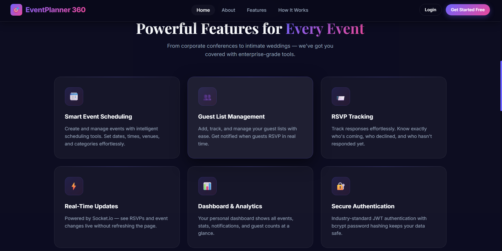
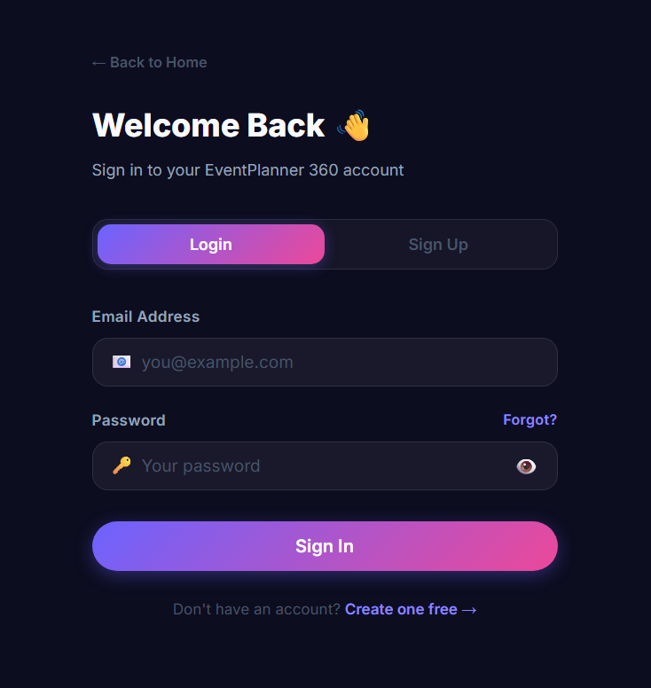
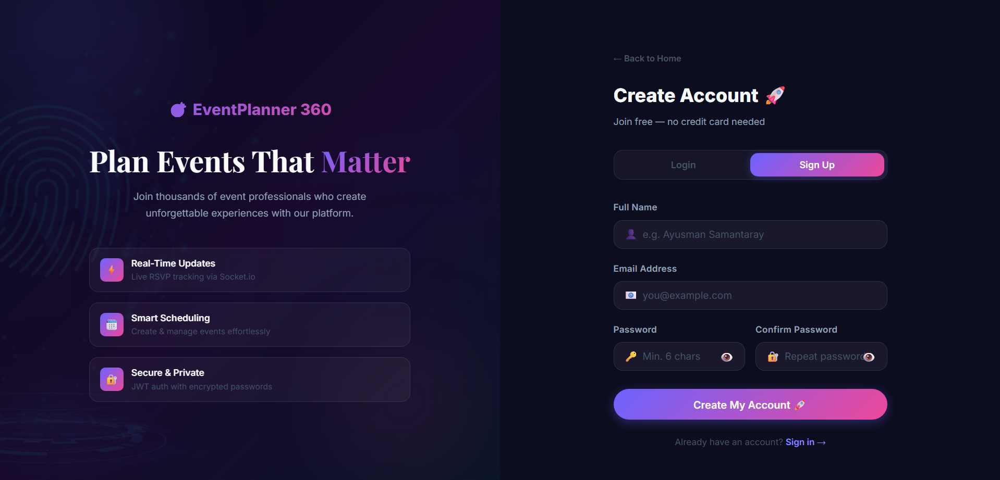

<div align="center">
  
  <h1>🎯 EventPlanner 360</h1>
  <p><strong>A Professional Full-Stack Event Management Platform</strong></p>
  <p>Built as part of the CBTC Internship Project by <b>Ayusman Samantaray</b>.</p>
</div>

<hr />

## 📖 Overview

**EventPlanner 360** is a comprehensive, real-time event management web application. It allows users to securely register, organize events, manage guest lists, process RSVPs, and visualize event statistics—all within a beautiful, dynamic, glassmorphic UI.

---

## ✨ Key Features

- **🔐 Secure Authentication:** JWT-based login and signup with `bcrypt` password hashing.
- **🎨 Modern Glassmorphic UI:** Professional dark-themed design with vibrant gradients, smooth animations, and responsive layouts.
- **🗓️ Event Management:** Create, update, delete, and color-code events. Categorize events by type (Conference, Wedding, Birthday, etc.).
- **👥 Guest & RSVP System:** Add guests to specific events and track their real-time RSVP responses.
- **⚡ Real-Time Updates:** Live push notifications and automatic dashboard refreshes powered by `Socket.io` (no page reloads needed!).
- **📊 Interactive Dashboard:** See real-time metrics, upcoming events, and personal notifications.
- **📥 Excel Data Export:** Download your data (Events, Guests, RSVPs, Notifications) as `.xlsx` spreadsheets directly from your dashboard.
- **🗄️ Robust SQLite Database:** Seamless local SQL database that auto-generates on first run.

---

## 🏗️ Project Flowchart & Architecture

The application follows a standard Full-Stack Client-Server architecture. The frontend communicates with the Node.js backend via RESTful APIs and maintains a persistent WebSockets connection for live updates.



---

## 🗂️ Project Structure

```text
CBTC-360-Event-Management-Planning-Webpage/
│
├── index.html               # Public Landing Page
├── login.html               # Authentication (Login / Signup)
├── dashboard.html           # Private User Dashboard & Real-Time Stats
├── event.html               # Quick Event Creation Page
├── about.html               # Platform Information & Tech Stack
│
├── frontend/                # Frontend Assets (Served Statically)
│   ├── css/
│   │   └── main.css         # Complete UI Design System (Glassmorphism)
│   ├── js/
│   │   └── api.js           # API Wrapper, Toast System, Scroll Animations
│   └── assets/              # Webpage Images & Graphics
│
└── backend/                 # Node.js Express Server
    ├── server.js            # Main Server Entry Point & Config
    ├── package.json         # Node Dependencies
    ├── .env                 # Environment Variables (Port, JWT Secret)
    ├── database/
    │   ├── db.js            # SQLite Initialization & Schema
    │   └── eventplanner.db  # (Auto-generated Database File)
    ├── middleware/
    │   └── auth.js          # JWT Verification Guard
    └── routes/
        ├── auth.js          # Login, Signup, Session APIs
        ├── events.js        # Event CRUD, Guest & RSVP APIs
        ├── users.js         # Dashboard Stats & Notifications APIs
        └── export.js        # Excel (.xlsx) Download Endpoints
```

---

## 🚀 Setup & Run Instructions

Follow these exact steps to run the platform locally on your machine.

### Prerequisites
- [Node.js](https://nodejs.org/) installed on your machine (v18+ recommended).

### Step 1: Open the Terminal
Open your terminal (PowerShell, Command Prompt, or VS Code Terminal) and navigate to the project directory:
```bash
cd "c:\Users\ayusm\OneDrive\Desktop\Internship projects\CBTC-360-Event-Management-Planning-Webpage"
```

### Step 2: Install Dependencies
Navigate into the `backend` folder and install all required Node packages:
```bash
cd backend
npm install
```

### Step 3: Setup Environment Variables
Create a file named `.env` inside the `backend` folder and add the following configuration:
```env
PORT=5000
JWT_SECRET=your_jwt_secret_key_here
JWT_EXPIRES_IN=7d
DB_PATH=./database/eventplanner.db
NODE_ENV=development
```

### Step 4: Start the Backend Server
Run the server file. **(Everything is served from this single command)**:
```bash
node server.js
```
*Note: The first time you run this, it will automatically create the `eventplanner.db` SQLite database inside the `database/` folder.*

You will see the following output indicating success:
```text
╔══════════════════════════════════════════════════════╗
║       EventPlanner 360 — Backend Server              ║
╠══════════════════════════════════════════════════════╣
║  🚀 Open:      http://localhost:5000                 ║
║  🗄  Database: SQLite  (eventplanner.db)             ║
║  🔴 Real-time: Socket.io enabled                    ║
╚══════════════════════════════════════════════════════╝
```

> **⚠️ EADDRINUSE Error?** If you see an `EADDRINUSE :::5000` error, it simply means your server is **already running** in the background or in another terminal window. You can simply proceed to Step 5!

### Step 5: Access the Web App
Open your favorite web browser and navigate to:
👉 **[http://localhost:5000](http://localhost:5000)**

*(The backend Express server automatically serves all the HTML, CSS, JS, and image files directly to your browser).*

---

## 🛠️ Technology Stack

| Domain | Technologies Used |
| :--- | :--- |
| **Frontend** | HTML5, CSS3 (Vanilla, Custom Variables, Flexbox/Grid), JavaScript |
| **Backend Framework** | Node.js, Express.js |
| **Database** | SQLite (`better-sqlite3` native bindings) |
| **Real-Time Engine** | Socket.io |
| **Security** | JSON Web Tokens (JWT), `bcryptjs` (Password Hashing) |
| **Data Export** | `xlsx` (SheetJS) pure-js generation |

---

---

## 🖼️ User Interface Gallery

### 1. Landing & Discovery
Experience a modern, glassmorphic landing page designed for seamless navigation and professional appeal.

| Home Page | Services & Features |
| :---: | :---: |
|  |  |

---

### 2. Secure Authentication
Vibrant, responsive Login and Signup interfaces featuring JWT-based protection and real-time validation.

| Welcome Back | Create Account |
| :---: | :---: |
|  |  |

---

### 3. Personal Dashboard & Analytics
A centralized hub for real-time metrics, upcoming event tracking, and automated notifications.


---

### 4. Core Management Features
Effortlessly organize events and manage your data with our intuitive tools.

#### **Smart Event Creation**
*Detailed forms for scheduling, categorization, and color-coding.*


#### **Advanced Excel Export**
*One-click data portability for Events, Guest Lists, and RSVP responses.*


---

<div align="center">
  <p><b>EventPlanner 360</b> — Planning made perfect.</p>
</div>
